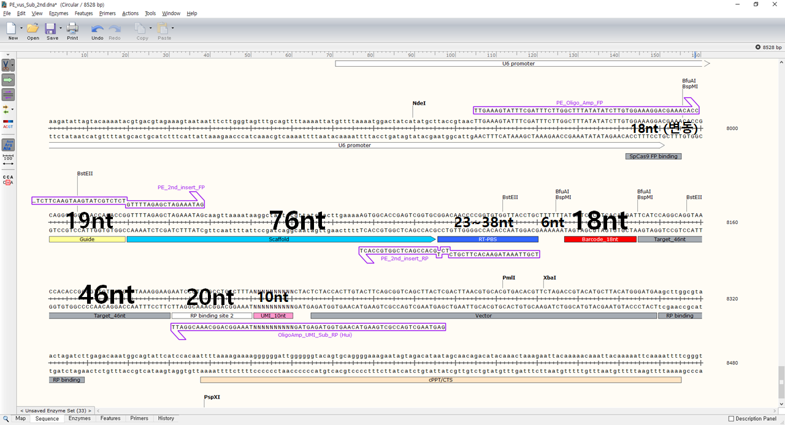

# PE_vus
Find brcd and umi from FASTQ. Goosang's project in 2021. 03. 25.

    [OLD PE vus sub-pool]

    [barcode file]

    
    [NEW PE vus sub-pool]

    [procedure]
        win_size = 2
        1. get "T"*6 + barcode sequence between (18 + 19 + 76 + 23)nt ~ (18 + 19 + 76 + 38)nt  : (RT-PBS(23~38bp))
            check "T"*6 + barcode sequence by sliding window
        2. find "CTACTCTACCAC" sequnce after (target seq length + length of RP_binding_site_2 + win_size)nt
        3. get 10nt UMI right before "CTACTCTACCAC"

result form
barcode | #tot_freq_barcode | umi | #freq_umi

