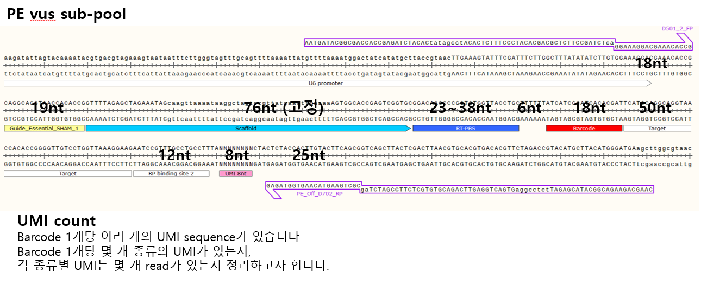
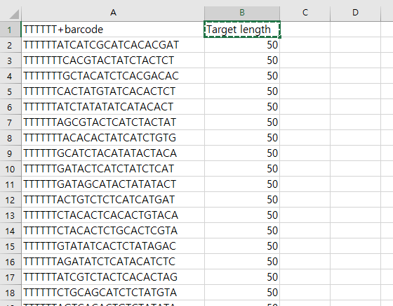
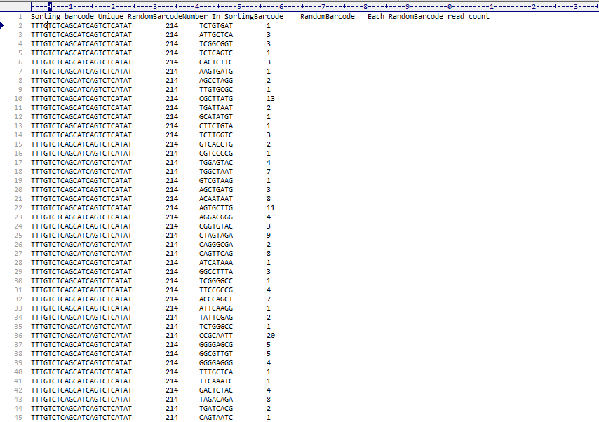

# PE_vus
Find brcd and umi from FASTQ. Goosang's project in 2021. 03. 25.

    [PE vus sub-pool]

    [barcode file]

    [procedure]
        win_size = 2
        1. get "T"*6 + barcode sequence after (18 + 19 + 76)nt
        2. find half of RP_binding_site_2 sequnce after (target seq length + half length of RP_binding_site_2 + win_size)nt
            half of RP_binding_site_2 = "CCTGCCTTTA"
        3. get 8nt UMI after half of RP_binding_site_2

result form

